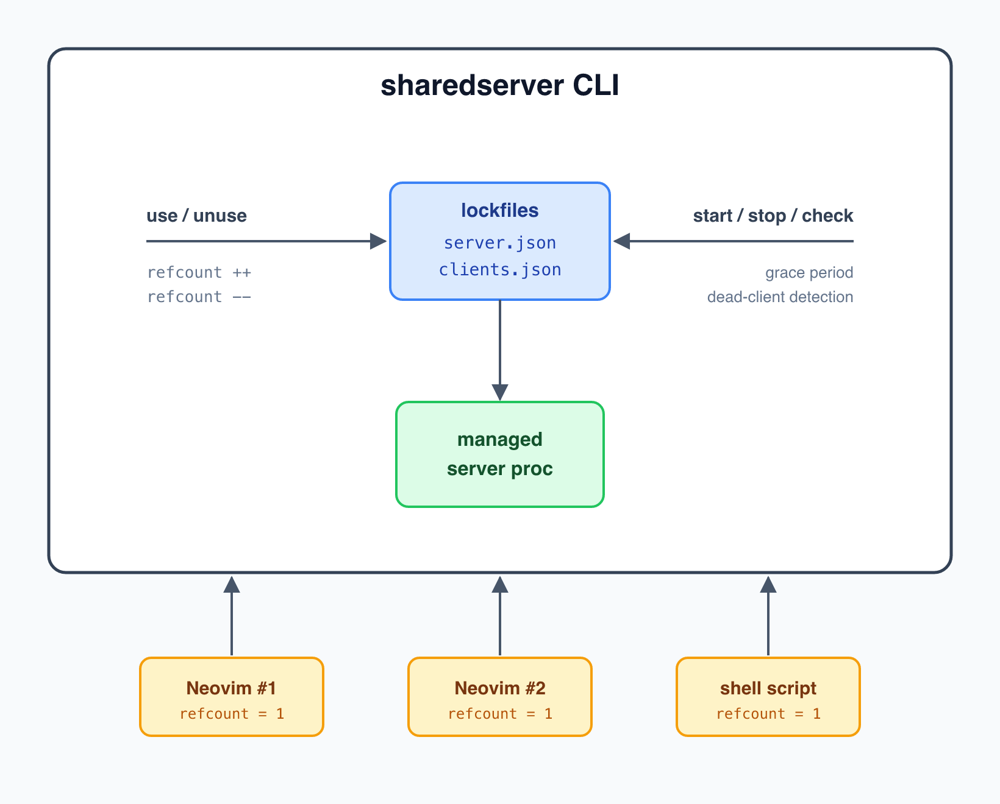
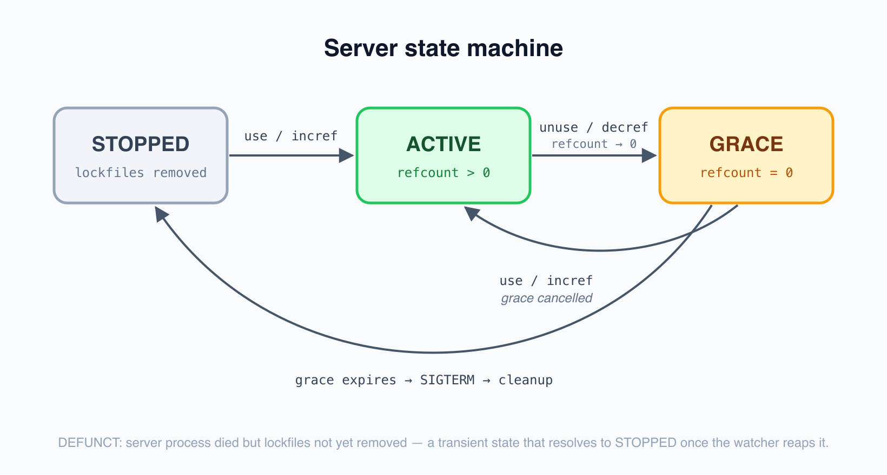
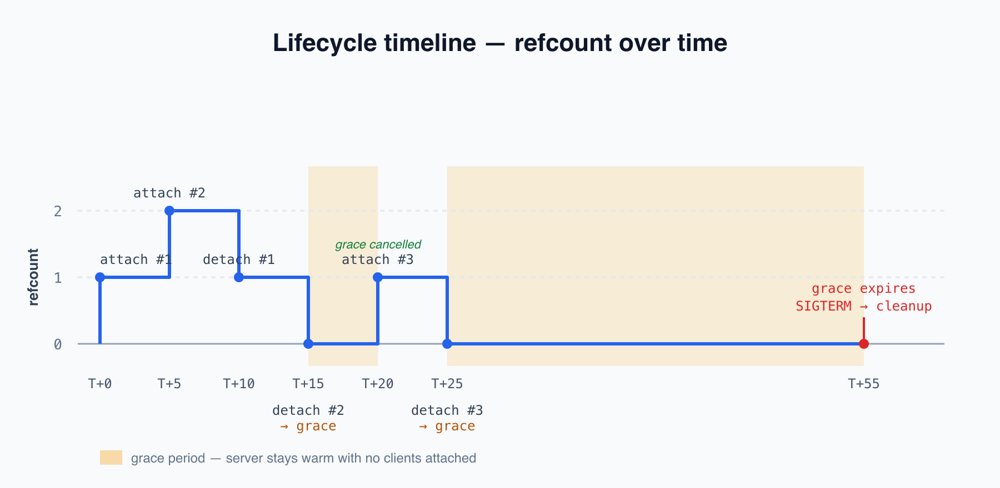

# sharedserver

[![crates][crates]](https://crates.io/crates/sharedserver)

A shared process manager with reference counting, grace periods, and dead-client detection. Use it standalone from the command line or integrate it with Neovim for automatic server lifecycle management.

> 📖 Rendered documentation:
> [docs.georgeharker.com/sharedserver](https://docs.georgeharker.com/sharedserver/)

## Overview

<p align="center">
  
</p>

One server process, shared across any number of clients. When the last client disconnects, an optional grace period keeps the server warm before shutdown.

## Standalone CLI

### Install

```bash
cargo install sharedserver
```

Or build from source:

```bash
git clone https://github.com/georgeharker/sharedserver
cd sharedserver/rust
cargo build --release
# binary at rust/target/release/sharedserver
```

### Quick Start

```bash
# Start or attach to a server (starts if not running)
sharedserver use myserver -- python -m http.server 8000

# Detach when done (server stays alive if other clients are attached)
sharedserver unuse myserver

# Check status
sharedserver info myserver
sharedserver list
```

The `use` command increments the refcount (starting the server if needed), and `unuse` decrements it. When refcount hits zero, the server enters a grace period or shuts down immediately.

### Grace Periods

Keep servers warm after the last client disconnects:

```bash
# Start with a 30-minute grace period
sharedserver use myserver --grace-period 30m -- ./expensive-server

# All clients disconnect -> server survives 30 minutes
# New client attaches during grace -> grace cancelled, back to active
# Grace expires -> server receives SIGTERM
```

Duration formats: `30s`, `5m`, `1h`, `2h30m`.

### Shell Script Integration

```bash
#!/bin/bash
# Ensure ChromaDB is running, share it across scripts
sharedserver use chroma --grace-period 1h -- chroma run --path ~/.local/share/chromadb

# Do work...
curl http://localhost:8000/api/v1/heartbeat

# Detach when done
sharedserver unuse chroma
```

Replace fragile `pkill`/`pgrep` patterns:

```bash
# Instead of this:
pkill -f "python -m http.server" || true
python -m http.server 8000 &
# ...work...
pkill -f "python -m http.server"

# Use sharedserver:
sharedserver use webserver -- python -m http.server 8000
# ...work...
sharedserver unuse webserver  # server stays alive if others need it
```

### CLI Commands

**Everyday commands:**

| Command | Description |
|---------|-------------|
| `use <name> [-- <cmd> [args...]]` | Attach to server (starts if needed) |
| `unuse <name>` | Detach from server |
| `list` | Show all managed servers |
| `info <name> [--json]` | Server details (formatted or JSON) |
| `check <name>` | Test if server exists (exit: 0=active, 1=grace, 2=stopped, 3=defunct) |
| `completion <shell>` | Generate shell completions (bash/zsh/fish) |

**Admin commands** (troubleshooting):

| Command | Description |
|---------|-------------|
| `admin start <name> -- <cmd>` | Manually start a server with no clients (refcount 0) |
| `admin stop <name> [--force] [--timeout DUR]` | SIGTERM, then wait for full teardown (`--force` escalates to SIGKILL) |
| `admin incref <name> --pid <pid>` | Manual refcount increment |
| `admin decref <name> --pid <pid>` | Manual refcount decrement |
| `admin debug <name>` | Show invocation logs |
| `admin doctor [name]` | Validate state, clean genuinely-stale lockfiles |
| `admin kill <name>` | Hard kill (SIGKILL watcher + server) and clean up — the floor |

See [Stopping a server](#stopping-a-server-stop-vs-stop---force-vs-kill) for when to use each.

**PID behavior:**
- User commands (`use`, `unuse`): `--pid` defaults to parent process (the caller)
- Admin commands: `--pid` defaults to current process

### Shell Completions

```bash
# Bash
sharedserver completion bash > ~/.local/share/bash-completion/completions/sharedserver

# Zsh
sharedserver completion zsh > ~/.zsh/completions/_sharedserver

# Fish
sharedserver completion fish > ~/.config/fish/completions/sharedserver.fish
```

## How It Works

### Two-Lockfile Architecture

Each server uses two JSON state files plus an append-only log (default location
`$XDG_RUNTIME_DIR/sharedserver/` or `/tmp/sharedserver/`). Each JSON file is
*both* the data and its own `flock` mutex — there is no separate lock file.

- **`<name>.server.json`** — the **server** side: `pid`, `command` (argv only,
  not env vars), `grace_period`, `watcher_pid`, `started_at`, and `start_time`
  (an opaque `/proc` start stamp used to detect PID reuse). Created at start,
  deleted at final teardown.
- **`<name>.clients.json`** — the **clients** side: `refcount` and a map of
  client PID → `{attached_at, metadata}`. Created at start and kept for the
  whole life of the server; **refcount 0 means grace** (the file stays with an
  empty client map — it is *not* deleted when the last client leaves). Deleted
  only at final teardown, alongside `server.json`.
- **`<name>.invocations.log`** — append-only audit log read by `admin debug`.

`refcount` is always kept equal to the number of distinct client PIDs, so a
repeat attach from the same PID is idempotent. Override the directory with
`SHAREDSERVER_LOCKDIR`.

### States

<p align="center">
  
</p>

- **ACTIVE**: refcount > 0, server running normally
- **GRACE**: refcount = 0 (`clients.json` present with an empty client map), server alive but countdown running
- **STOPPED**: both JSON files deleted, server terminated
- **DEFUNCT**: Server process has died but the lockfiles haven't been removed yet
  (the process is a zombie awaiting reap). Transient: the watcher reaps it and
  removes the lockfiles, after which the state becomes STOPPED. Commands that
  need a running server (`incref`, `use`, …) refuse a defunct server and ask you
  to retry shortly.

### The watcher owns the lifecycle

Each running server has a **watcher** process (its parent). The watcher is the
single owner of the server's lifecycle:

- It **polls every 500 ms**, checking each client PID (Linux: `/proc/<pid>`
  state; macOS: `proc_pidinfo()`). Dead clients are removed from the refcount;
  if all clients die, the grace period starts automatically (no refcount leaks).
- It **reaps the server** (`waitpid`) when it exits, so no zombie lingers.
- It is the **only thing that deletes the lockfiles** on the normal path, keyed
  to the server PID it owns — so a stale watcher can never clobber a freshly
  restarted instance that reused the same name.

`stop`/`stop --force` cooperate with this by *signalling and waiting* rather than
deleting lockfiles themselves; `kill` is the exception (see below).

### Stopping a server: `stop` vs `stop --force` vs `kill`

| | First signal | Graceful wait | Escalates to SIGKILL | Kills the watcher | Deletes lockfiles |
|---|---|---|---|---|---|
| `stop` | SIGTERM | yes (`--timeout`) | no — errors, leaves state intact | no | watcher does |
| `stop --force` | SIGTERM | yes (`--timeout`) | yes, then waits again | no | watcher does |
| `kill` | SIGKILL | none | n/a (starts at SIGKILL) | **yes** | **itself** |

- **`stop`** — *stop cleanly now.* Sends SIGTERM, then **waits until the watcher
  has reaped the server, removed the lockfiles, and exited**. If the server
  ignores SIGTERM within `--timeout` (default 10s) it errors and changes
  nothing — use `--force`.
- **`stop --force`** — *stop cleanly, else absolutely stop.* Same graceful path,
  then escalates to SIGKILL and waits again. On failure it reports exactly what
  survived (server / watcher / lockfile) and points you at `kill`.
- **`kill`** — *the floor: absolutely stop now.* Never depends on the watcher
  (use it when the watcher is wedged): SIGKILLs the watcher first, then the
  server's process group, then removes the lockfiles itself. The orphaned server
  is reaped by init.

Because `stop`/`--force` wait for full teardown before returning, an immediate
restart with the same name is safe — there is no surviving watcher to race.

### Lifecycle Timeline

<p align="center">
  
</p>

---

## Neovim Integration

For the full guide — building from source, health monitoring, status UI details,
manual Lua usage, lazy loading, notification config — see
[docs/NEOVIM.md](docs/NEOVIM.md).

### Requirements

- Neovim 0.10+

### Installation

Using [lazy.nvim](https://github.com/folke/lazy.nvim):

```lua
{
    "georgeharker/sharedserver",
    build = "cargo install --path rust",
    config = function()
        require("sharedserver").setup({
            servers = {
                chroma = {
                    command = "chroma",
                    args = { "run", "--path", "~/.local/share/chromadb" },
                    idle_timeout = "30m",
                },
            }
        })
    end
}
```

The plugin searches for the `sharedserver` binary in order:
1. `<plugin-dir>/rust/target/release/sharedserver`
2. `~/.local/bin/sharedserver`
3. `/usr/local/bin/sharedserver`
4. `/opt/homebrew/bin/sharedserver`

It does not search `$PATH`, so a binary that only lives in `~/.cargo/bin`
won't be found — build with the `build` command above, or copy it to one of
the locations listed.

### What the Plugin Does

On `VimEnter`:
- Non-lazy servers: checks if running → attaches (incref) or starts
- Lazy servers: attaches if running, otherwise does nothing

On `VimLeave`:
- Automatically decrements refcount for all attached servers

This means multiple Neovim instances share the same server process, and the server survives editor restarts within the grace period.

### Server Configuration

```lua
require("sharedserver").setup({
    servers = {
        myserver = {
            command = "myserver",           -- required: command to run
            args = { "--port", "8080" },    -- optional: arguments
            env = { DEBUG = "1" },          -- optional: extra env vars (additive)
            working_dir = "/path/to/dir",   -- optional: working directory
            log_file = "/tmp/myserver.log", -- optional: capture stdout/stderr
            lazy = false,                   -- optional: only attach if already running
            idle_timeout = "30m",           -- optional: grace period after last client
            on_start = function(pid) end,   -- optional: callback on start
        },
    },
    commands = true,  -- create user commands (default: true)
    notify = {
        on_start = true,   -- notify when starting new server
        on_attach = false,  -- notify when attaching to existing
        on_stop = false,    -- notify when stopping
        on_error = true,    -- always notify on errors
    },
})
```

### Commands

| Command | Description |
|---------|-------------|
| `:ServerStart <name>` | Start a named server |
| `:ServerStop <name>` | Stop a named server |
| `:ServerRestart <name>` | Restart a named server |
| `:ServerStatus [name]` | Show status in floating window |
| `:ServerList` | List all registered servers |
| `:ServerStopAll` | Stop all servers |

`:ServerStatus` shows a floating window with status indicators:
- `●` Running (active or in grace period)
- `○` Stopped

The single-server view (`:ServerStatus <name>`) additionally flags servers in
their grace period.

### Lua API

```lua
local ss = require("sharedserver")

ss.setup({ servers = { ... } })   -- initialize
ss.register(name, config)          -- add server after setup
ss.start(name)                     -- manual start
ss.stop(name)                      -- manual stop
ss.restart(name)                   -- restart
ss.stop_all()                      -- stop all servers
ss.status(name)                    -- { running, pid, refcount, attached, lazy }
ss.status_all()                    -- all server statuses
ss.list()                          -- registered server names
```

### Health Check

```vim
:checkhealth sharedserver
```

Verifies binary installation, lock directory access, and server status.

---

## Editor Integrations: OpenCode & Claude Code

OpenCode and Claude Code have the same lifecycle problem Neovim does: several
editor sessions want to share one backend process. Two sibling plugins wire this
CLI into their lifecycles — `sharedserver use` on session start, `sharedserver
unuse` on session end — so servers come up with the editor and tear down cleanly
when the last session leaves. Both live here as plain in-tree directories under
`plugins/`:

| Plugin | Host | Directory | Guide | Published as |
|--------|------|-----------|-------|--------------|
| [opencode-sharedserver](https://github.com/georgeharker/sharedserver/tree/main/plugins/opencode) | [OpenCode](https://opencode.ai) | `plugins/opencode` | [docs/OPENCODE.md](docs/OPENCODE.md) | npm [`@geohar/opencode-sharedserver`](https://www.npmjs.com/package/@geohar/opencode-sharedserver) |
| [claude-sharedserver](https://github.com/georgeharker/sharedserver/tree/main/plugins/claude) | [Claude Code](https://docs.claude.com/en/docs/claude-code/overview) | `plugins/claude` | [docs/CLAUDE_CODE.md](docs/CLAUDE_CODE.md) | Claude Code plugin marketplace |

Their per-server config (`command`, `args`, `env`, `gracePeriod`, `logFile`,
`metadata`, `lazy`) is intentionally compatible — a `servers` map copies across
OpenCode, Claude Code, and the Neovim config without changes.

```jsonc
// OpenCode — ~/.config/opencode/config.json
{
    "plugin": [
        ["@geohar/opencode-sharedserver@latest", {
            "servers": {
                "chroma": {
                    "command": "chroma",
                    "args": ["run", "--path", "{env:HOME}/.local/share/chromadb"],
                    "gracePeriod": "30m"
                }
            }
        }]
    ]
}
```

```jsonc
// Claude Code — ~/.config/claude/sharedserver.json
{
    "servers": {
        "chroma": {
            "command": "chroma",
            "args": ["run", "--path", "${HOME}/.local/share/chromadb"],
            "gracePeriod": "30m"
        }
    }
}
```

See each plugin's guide above for the full option reference, diagnostics, and
local-development instructions.

### Working with the plugins

The plugins are plain in-tree directories (`plugins/opencode`, `plugins/claude`),
so a plain clone already contains their full source — no submodule init needed:

```bash
git clone https://github.com/georgeharker/sharedserver
```

To change a plugin, edit its files under `plugins/` directly and commit as normal:

```bash
$EDITOR plugins/opencode/src/index.ts   # or plugins/claude/...
git add plugins/opencode && git commit -m "feat(opencode): ..."
```

## Use Cases

**Development databases** -- ChromaDB, Redis, PostgreSQL shared across editor instances with grace periods for quick restarts.

**Project dev servers** -- frontend/backend servers that survive editor restarts.

**Expensive services** -- ML inference servers with `lazy = true`, started only when needed.

**CI/test infrastructure** -- shell scripts managing shared test services with automatic cleanup.

### Why Not systemd/launchd?

| System Service | sharedserver |
|----------------|--------------|
| Always running | Starts when needed, stops when done |
| Requires root/system config | User-space, no sudo |
| Global config files | Per-project config |
| Manual start/stop | Automatic lifecycle |
| One instance system-wide | Multiple isolated instances |

Use system services for production/always-on infrastructure. Use sharedserver for on-demand development services tied to your workflow.

## Debugging

### Capture Server Output

```lua
-- Option 1: log_file option
{
    command = "myserver",
    log_file = "/tmp/myserver.log",
}

-- Option 2: shell redirect
{
    command = "bash",
    args = { "-c", "myserver 2>&1 | tee /tmp/myserver.log" },
}
```

### Common Issues

- **Server exits immediately**: capture output with `log_file`, check environment, use absolute paths
- **Command not found**: use absolute path in `command`
- **Port in use**: check `:ServerStatus`, `sharedserver list`, or `lsof -i :PORT`
- **Stale lockfiles**: `sharedserver admin doctor` to validate and clean up

See [DEBUGGING.md](docs/DEBUGGING.md) for the full troubleshooting guide, and [EXAMPLES.md](./EXAMPLES.md) for more configuration patterns.

## License

MIT

[crates]: https://img.shields.io/crates/v/sharedserver.svg
